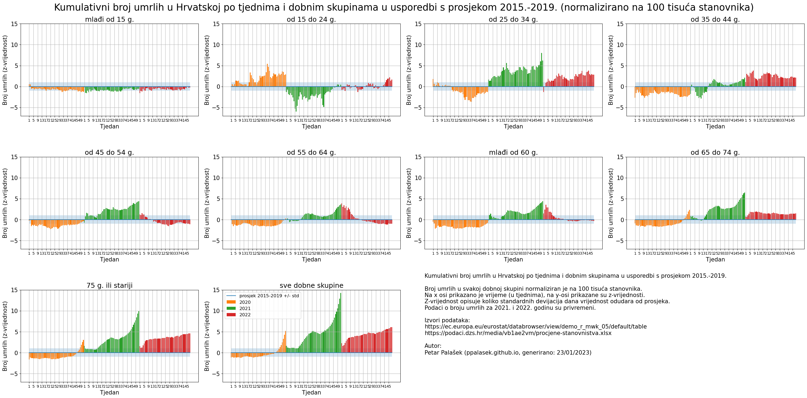

### Croatia excess deaths

* compared to 2015-2019 average
* data from: https://ec.europa.eu/eurostat/databrowser/view/demo_r_mwk_05/default/table
* population data from: https://podaci.dzs.hr/media/vb1ae2vm/procjene-stanovnistva.xlsx

#### Z score per age group (per week)

##### same y axis

#### Z score per age group (cumulative deaths)

##### same y axis

#### 

#### All age groups

