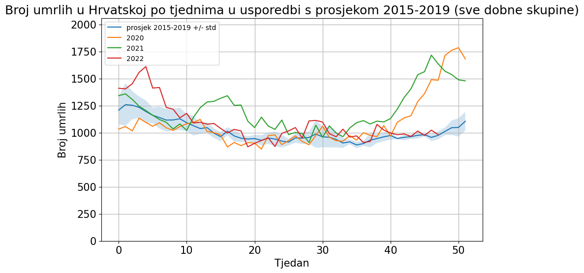

### Croatia excess deaths

* compared to 2015-2019 average
* data from: https://appsso.eurostat.ec.europa.eu/nui/show.do?dataset=demo_r_mwk_05&lang=en
* population data from: https://podaci.dzs.hr/media/vb1ae2vm/procjene-stanovnistva.xlsx

#### Z score per age group

#### All age groups

